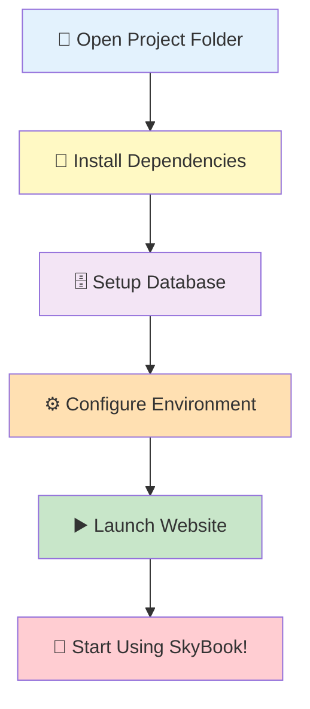
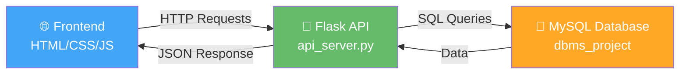

# 🚀 SkyBook Quick Start Guide

Welcome to **SkyBook** - Your Flight Booking System! This guide will help you get the website up and running in minutes.

---

## 📋 Prerequisites Checklist

Before you begin, ensure you have:

- [ ] **Python 3.7+** installed ([Download here](https://www.python.org/downloads/))
- [ ] **MySQL Server** installed and running ([Download here](https://dev.mysql.com/downloads/))
- [ ] **Git** (optional, for version control)

---

## 🗺️ Setup Workflow



---

## 🛠️ Step-by-Step Setup

### **Step 1: Install Python Dependencies** 📦

Open your terminal in the project folder and run:

```bash
pip install -r requirements.txt
```

> [!TIP]
> If you encounter permission errors, try using `pip install --user -r requirements.txt`

**What's being installed:**

- Flask (Web framework)
- Flask-CORS (Cross-origin resource sharing)
- mysql-connector-python (Database connector)
- pandas (Data processing)

---

### **Step 2: Setup MySQL Database** 🗄️

#### 2.1 Create the Database

1. Open **MySQL Workbench** or connect via terminal:

   ```bash
   mysql -u root -p
   ```

2. Create the database:
   ```sql
   CREATE DATABASE dbms_project;
   USE dbms_project;
   ```

#### 2.2 Import the Schema

```bash
mysql -u root -p dbms_project < DBMS_PROJECT.sql
```

> [!IMPORTANT]
> Make sure MySQL server is running before executing this step!

---

### **Step 3: Configure Environment** ⚙️

#### 3.1 Create `.env` file

Copy the example environment file:

```bash
copy .env.example .env     # Windows
cp .env.example .env       # Mac/Linux
```

#### 3.2 Update Database Credentials

Open `.env` and update with your MySQL credentials:

```ini
DB_HOST=localhost
DB_PORT=3306
DB_USER=root
DB_PASSWORD=your_password_here
DB_NAME=dbms_project
```

> [!CAUTION]
> Never commit your `.env` file to version control! It contains sensitive information.

---

### **Step 4: Launch SkyBook** 🚀

#### Option A: One-Click Launch (Windows)

Double-click on:

```
launch_skybook.bat
```

#### Option B: Manual Launch

```bash
python launch_skybook.py
```

#### Option C: Launch Components Separately

**Terminal 1 - Start API Server:**

```bash
python api_server.py
```

**Terminal 2 - Open Website:**
Open `index.html` in your browser

---

## 🎯 Quick Architecture Overview



---

## ✅ Verification Checklist

After launching, verify everything is working:

- [ ] API Server is running on `http://localhost:5000`
- [ ] Website opens in your browser
- [ ] Can view available flights
- [ ] Can register a new account
- [ ] Can login with credentials
- [ ] Can search for flights

---

## 🆘 Troubleshooting

| Issue                          | Solution                                                                             |
| ------------------------------ | ------------------------------------------------------------------------------------ |
| **Port 5000 already in use**   | Kill existing process: `netstat -ano \| findstr :5000` then `taskkill /PID <PID> /F` |
| **Database connection failed** | Check MySQL is running and credentials in `.env` are correct                         |
| **Module not found errors**    | Reinstall dependencies: `pip install -r requirements.txt`                            |
| **CORS errors**                | Ensure `Flask-CORS` is installed and API server is running                           |
| **Login/Registration fails**   | Check database tables exist: `SHOW TABLES;` in MySQL                                 |

---

## 📂 Project Structure

```
DBMS PROJECT/
├── 🌐 Frontend
│   ├── index.html              # Main website
│   ├── reset-password.html     # Password reset page
│   ├── app.js                  # Frontend logic
│   └── styles.css              # Styling
│
├── 🔧 Backend
│   ├── api_server.py           # Main API server
│   ├── config.py               # Configuration
│   ├── db_connection_pool.py   # Database pooling
│   ├── email_service.py        # Email functionality
│   └── password_reset_manager.py
│
├── 🗄️ Database
│   ├── DBMS_PROJECT.sql        # Complete schema + data
│   └── flight_dataset_cleaned.csv
│
├── 🚀 Launchers
│   ├── launch_skybook.py       # Python launcher
│   └── launch_skybook.bat      # Windows batch launcher
│
└── 📋 Documentation
    ├── README.md
    └── QUICK_START.md (this file)
```

---

## 🎓 Next Steps

Once you have SkyBook running, explore these features:

1. **👤 User Management** - Register, login, password reset
2. **✈️ Flight Search** - Search by origin, destination, date
3. **🎫 Booking System** - Book flights with seat selection
4. **📊 Admin Panel** - Manage flights and bookings
5. **📧 Email Notifications** - Password resets and booking confirmations

---

## � Need Help?

- 📖 Check [README.md](README.md) for detailed documentation
- 🔍 Review [QUICK_REFERENCE.md](QUICK_REFERENCE.md) for common commands
- 📁 Browse code comments for implementation details

---

> [!NOTE] > **First Time Setup:** The complete setup should take approximately 10-15 minutes.
>
> **After First Setup:** Just double-click `launch_skybook.bat` to start!

---

<div align="center">

### 🎉 You're Ready to Fly with SkyBook! ✈️

**Happy Booking!** 🚀

</div>
