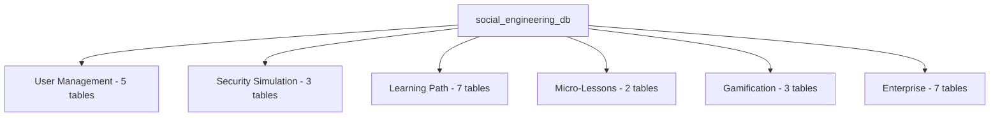

# Advanced MySQL Queries & Database Structure
## Social Engineering Training Simulator

---

## Table of Contents
1. [Database Structure Overview](#database-structure)
2. [Entity Relationship Diagram](#er-diagram)
3. [Table Definitions](#table-definitions)
4. [Advanced SQL Queries](#advanced-queries)
5. [Stored Procedures & Functions](#stored-procedures)
6. [Triggers](#triggers)
7. [Views](#views)

---

## 1. Database Structure Overview

**Database Name:** `social_engineering_db`  
**Total Tables:** 22  
**Storage Engine:** InnoDB  
**Character Set:** UTF8MB4  

### Table Categories



---

## 2. Entity Relationship Diagram

### Core ER Diagram

```
┌─────────────┐
│   USERS     │
│─────────────│
│ user_id PK  │────┐
│ username    │    │
│ password    │    │
│ total_score │    │
└─────────────┘    │
                   │ 1:N
         ┌─────────┴──────────┐
         │                    │
         ▼                    ▼
┌──────────────────┐  ┌──────────────────┐
│ USER_RESPONSES   │  │ USER_PROGRESS    │
│──────────────────│  │──────────────────│
│ response_id PK   │  │ progress_id PK   │
│ user_id FK       │  │ user_id FK       │
│ scenario_id FK   │  │ module_id FK     │
│ is_correct       │  │ status           │
│ response_time    │  │ score            │
└──────────────────┘  └──────────────────┘
         │                    │
         │                    │
         │ N:1                │ N:1
         ▼                    ▼
┌──────────────────┐  ┌──────────────────┐
│   SCENARIOS      │  │ LEARNING_MODULES │
│──────────────────│  │──────────────────│
│ scenario_id PK   │  │ module_id PK     │
│ scenario_type    │  │ level_id FK      │
│ difficulty_level │  │ category_id FK   │
│ correct_answer   │  │ content_json     │
└──────────────────┘  └──────────────────┘
```

### RBAC Relationship

```
┌───────────┐       ┌──────────────┐       ┌──────────────┐
│   USERS   │◄─────►│  USER_ROLES  │◄─────►│    ROLES     │
└───────────┘  1:N  └──────────────┘  N:1  └──────────────┘
                                               │
                                               │ 1:N
                                               ▼
                                      ┌──────────────────┐
                                      │ ROLE_PERMISSIONS │
                                      └──────────────────┘
                                               │
                                               │ N:1
                                               ▼
                                      ┌──────────────────┐
                                      │   PERMISSIONS    │
                                      └──────────────────┘
```

### Adaptive Learning Flow

```
┌──────────────┐
│    USERS     │
└──────┬───────┘
       │ Answers Incorrectly
       ▼
┌──────────────────┐
│ USER_RESPONSES   │
│ (is_correct=0)   │
└──────┬───────────┘
       │ Triggers Assignment
       ▼
┌──────────────────┐     N:1     ┌──────────────┐
│ ASSIGNED_LESSONS │────────────►│MICRO_LESSONS │
│──────────────────│             │──────────────│
│ user_id FK       │             │ category_id  │
│ lesson_id FK     │             │ quiz_json    │
│ status           │             └──────────────┘
└──────────────────┘
```

---

## 3. Table Definitions

### 3.1 Users Table
```sql
CREATE TABLE IF NOT EXISTS users (
    user_id INT AUTO_INCREMENT PRIMARY KEY,
    username VARCHAR(80) UNIQUE NOT NULL,
    password VARCHAR(255) NOT NULL,
    email VARCHAR(120),
    created_date DATETIME DEFAULT CURRENT_TIMESTAMP,
    total_score INT DEFAULT 0,
    vulnerability_level VARCHAR(32) DEFAULT 'Medium',
    organization VARCHAR(100),
    account_type VARCHAR(20) DEFAULT 'Individual',
    INDEX idx_username (username),
    INDEX idx_total_score (total_score DESC)
) ENGINE=InnoDB DEFAULT CHARSET=utf8mb4 COLLATE=utf8mb4_unicode_ci;
```

### 3.2 Scenarios Table
```sql
CREATE TABLE IF NOT EXISTS scenarios (
    scenario_id INT AUTO_INCREMENT PRIMARY KEY,
    scenario_type VARCHAR(50) NOT NULL,
    difficulty_level VARCHAR(32) NOT NULL,
    scenario_description TEXT NOT NULL,
    correct_answer VARCHAR(50) NOT NULL,
    keywords_to_identify TEXT,
    explanation TEXT,
    INDEX idx_scenario_type (scenario_type),
    INDEX idx_difficulty (difficulty_level)
) ENGINE=InnoDB DEFAULT CHARSET=utf8mb4 COLLATE=utf8mb4_unicode_ci;
```

### 3.3 User Responses Table
```sql
CREATE TABLE IF NOT EXISTS user_responses (
    response_id INT AUTO_INCREMENT PRIMARY KEY,
    user_id INT NOT NULL,
    scenario_id INT NOT NULL,
    user_response VARCHAR(50),
    is_correct BOOLEAN,
    response_time INT,
    timestamp DATETIME DEFAULT CURRENT_TIMESTAMP,
    FOREIGN KEY (user_id) REFERENCES users(user_id) ON DELETE CASCADE,
    FOREIGN KEY (scenario_id) REFERENCES scenarios(scenario_id) ON DELETE CASCADE,
    INDEX idx_user_id (user_id),
    INDEX idx_scenario_id (scenario_id),
    INDEX idx_timestamp (timestamp DESC)
) ENGINE=InnoDB DEFAULT CHARSET=utf8mb4 COLLATE=utf8mb4_unicode_ci;
```

### 3.4 Learning Modules Table
```sql
CREATE TABLE IF NOT EXISTS learning_modules (
    module_id INT AUTO_INCREMENT PRIMARY KEY,
    level_id INT NOT NULL,
    category_id INT NOT NULL,
    type_id INT NOT NULL,
    title VARCHAR(200) NOT NULL,
    description TEXT,
    content_json JSON,
    points_value INT DEFAULT 100,
    estimated_time_minutes INT DEFAULT 5,
    order_index INT DEFAULT 0,
    FOREIGN KEY (level_id) REFERENCES path_levels(level_id) ON DELETE CASCADE,
    FOREIGN KEY (category_id) REFERENCES categories(category_id),
    FOREIGN KEY (type_id) REFERENCES content_types(type_id),
    INDEX idx_level_order (level_id, order_index)
) ENGINE=InnoDB DEFAULT CHARSET=utf8mb4 COLLATE=utf8mb4_unicode_ci;
```

### 3.5 Audit Logs Table
```sql
CREATE TABLE IF NOT EXISTS audit_logs (
    audit_id BIGINT AUTO_INCREMENT PRIMARY KEY,
    user_id INT,
    username VARCHAR(80),
    action_type VARCHAR(100) NOT NULL,
    resource_type VARCHAR(50),
    resource_id INT,
    action_description TEXT NOT NULL,
    ip_address VARCHAR(45),
    user_agent TEXT,
    request_method VARCHAR(10),
    request_url VARCHAR(500),
    status ENUM('success', 'failure', 'error') NOT NULL,
    error_message TEXT,
    old_value JSON,
    new_value JSON,
    severity ENUM('low', 'medium', 'high', 'critical') DEFAULT 'medium',
    timestamp DATETIME DEFAULT CURRENT_TIMESTAMP,
    session_id VARCHAR(100),
    FOREIGN KEY (user_id) REFERENCES users(user_id) ON DELETE SET NULL,
    INDEX idx_user_id (user_id),
    INDEX idx_timestamp (timestamp DESC),
    INDEX idx_action_type (action_type),
    INDEX idx_status (status),
    INDEX idx_severity (severity)
) ENGINE=InnoDB DEFAULT CHARSET=utf8mb4 COLLATE=utf8mb4_unicode_ci;
```

---

## 4. Advanced SQL Queries

### 4.1 Complex Aggregation Queries

**Query 1: User Performance Dashboard**
```sql
SELECT 
    u.user_id,
    u.username,
    u.total_score,
    u.created_date,
    DATEDIFF(NOW(), u.created_date) as days_active,
    
    -- Total attempts and accuracy
    COUNT(DISTINCT ur.response_id) as total_responses,
    SUM(CASE WHEN ur.is_correct = 1 THEN 1 ELSE 0 END) as correct_responses,
    ROUND(
        (SUM(CASE WHEN ur.is_correct = 1 THEN 1 ELSE 0 END) / 
        NULLIF(COUNT(ur.response_id), 0)) * 100, 
        2
    ) as overall_accuracy,
    
    -- Average response time
    ROUND(AVG(ur.response_time), 2) as avg_response_time_seconds,
    
    -- Achievement count
    COUNT(DISTINCT a.achievement_id) as achievements_earned,
    
    -- Learning path progress
    COUNT(DISTINCT CASE WHEN up.status = 'completed' THEN up.module_id END) as modules_completed,
    COUNT(DISTINCT up.module_id) as modules_attempted,
    
    -- Rank
    (SELECT COUNT(*) + 1 
     FROM users u2 
     WHERE u2.total_score > u.total_score) as current_rank
     
FROM users u
LEFT JOIN user_responses ur ON u.user_id = ur.user_id
LEFT JOIN achievements a ON u.user_id = a.user_id
LEFT JOIN user_progress up ON u.user_id = up.user_id
WHERE u.user_id = ?
GROUP BY u.user_id;
```

**Query 2: Category-Wise Performance Analysis**
```sql
SELECT 
    u.username,
    c.category_name,
    c.icon,
    c.color_code,
    
    -- Module statistics
    COUNT(DISTINCT lm.module_id) as total_modules,
    COUNT(DISTINCT CASE WHEN up.status = 'completed' 
          THEN up.module_id END) as completed_modules,
    ROUND(
        (COUNT(DISTINCT CASE WHEN up.status = 'completed' THEN up.module_id END) / 
        NULLIF(COUNT(DISTINCT lm.module_id), 0)) * 100, 
        2
    ) as completion_percentage,
    
    -- Score statistics
    SUM(CASE WHEN up.status = 'completed' THEN up.score ELSE 0 END) as total_points_earned,
    ROUND(AVG(CASE WHEN up.status = 'completed' THEN up.score END), 2) as avg_score,
    MAX(up.score) as best_score,
    
    -- Time investment
    SUM(ma.time_spent_seconds) as total_time_spent_seconds,
    ROUND(SUM(ma.time_spent_seconds) / 60.0, 2) as total_time_spent_minutes,
    
    -- Attempt count
    COUNT(DISTINCT ma.attempt_id) as total_attempts,
    ROUND(AVG(ma.score), 2) as avg_attempt_score

FROM users u
CROSS JOIN categories c
LEFT JOIN learning_modules lm ON c.category_id = lm.category_id
LEFT JOIN user_progress up ON u.user_id = up.user_id AND lm.module_id = up.module_id
LEFT JOIN module_attempts ma ON u.user_id = ma.user_id AND lm.module_id = ma.module_id
WHERE u.user_id = ?
GROUP BY u.user_id, c.category_id
ORDER BY completion_percentage DESC, total_points_earned DESC;
```

**Query 3: Vulnerability Assessment by Attack Type**
```sql
SELECT 
    u.user_id,
    u.username,
    s.scenario_type,
    
    -- Response statistics
    COUNT(ur.response_id) as total_attempts,
    SUM(CASE WHEN ur.is_correct = 1 THEN 1 ELSE 0 END) as correct_count,
    SUM(CASE WHEN ur.is_correct = 0 THEN 1 ELSE 0 END) as incorrect_count,
    
    -- Success rate
    ROUND(
        (SUM(CASE WHEN ur.is_correct = 1 THEN 1 ELSE 0 END) / 
        NULLIF(COUNT(ur.response_id), 0)) * 100, 
        2
    ) as success_rate,
    
    -- Difficulty breakdown
    SUM(CASE WHEN s.difficulty_level = 'Easy' THEN 1 ELSE 0 END) as easy_attempts,
    SUM(CASE WHEN s.difficulty_level = 'Easy' AND ur.is_correct = 1 
        THEN 1 ELSE 0 END) as easy_correct,
    SUM(CASE WHEN s.difficulty_level = 'Medium' THEN 1 ELSE 0 END) as medium_attempts,
    SUM(CASE WHEN s.difficulty_level = 'Medium' AND ur.is_correct = 1 
        THEN 1 ELSE 0 END) as medium_correct,
    SUM(CASE WHEN s.difficulty_level = 'Hard' THEN 1 ELSE 0 END) as hard_attempts,
    SUM(CASE WHEN s.difficulty_level = 'Hard' AND ur.is_correct = 1 
        THEN 1 ELSE 0 END) as hard_correct,
    
    -- Time analysis
    ROUND(AVG(ur.response_time), 2) as avg_response_time,
    MIN(ur.response_time) as fastest_response,
    MAX(ur.response_time) as slowest_response,
    
    -- Vulnerability level determination
    CASE 
        WHEN (SUM(CASE WHEN ur.is_correct = 1 THEN 1 ELSE 0 END) / 
              NULLIF(COUNT(ur.response_id), 0)) >= 0.8 THEN 'Low Risk'
        WHEN (SUM(CASE WHEN ur.is_correct = 1 THEN 1 ELSE 0 END) / 
              NULLIF(COUNT(ur.response_id), 0)) >= 0.5 THEN 'Medium Risk'
        ELSE 'High Risk'
    END as vulnerability_level

FROM users u
INNER JOIN user_responses ur ON u.user_id = ur.user_id
INNER JOIN scenarios s ON ur.scenario_id = s.scenario_id
WHERE u.user_id = ?
GROUP BY u.user_id, s.scenario_type
ORDER BY success_rate ASC, total_attempts DESC;
```

### 4.2 Window Function Queries

**Query 4: Learning Progress Trend with Moving Average**
```sql
SELECT 
    user_id,
    module_id,
    attempt_number,
    score,
    attempt_date,
    
    -- Running statistics
    ROW_NUMBER() OVER (PARTITION BY user_id, module_id 
                       ORDER BY attempt_date) as attempt_sequence,
    
    RANK() OVER (PARTITION BY user_id, module_id 
                 ORDER BY score DESC) as score_rank,
    
    -- Moving average (last 5 attempts)
    ROUND(
        AVG(score) OVER (PARTITION BY user_id 
                         ORDER BY attempt_date 
                         ROWS BETWEEN 4 PRECEDING AND CURRENT ROW),
        2
    ) as moving_avg_score,
    
    -- Cumulative score
    SUM(score) OVER (PARTITION BY user_id 
                     ORDER BY attempt_date) as cumulative_score,
    
    -- Score improvement
    score - LAG(score, 1) OVER (PARTITION BY user_id, module_id 
                                 ORDER BY attempt_date) as score_delta,
    
    -- Best score so far
    MAX(score) OVER (PARTITION BY user_id, module_id 
                     ORDER BY attempt_date) as best_score_so_far

FROM module_attempts
ORDER BY user_id, module_id, attempt_date;
```

**Query 5: Leaderboard with Percentile Ranking**
```sql
SELECT 
    user_id,
    username,
    total_score,
    
    -- Basic ranking
    ROW_NUMBER() OVER (ORDER BY total_score DESC) as absolute_rank,
    RANK() OVER (ORDER BY total_score DESC) as tied_rank,
    DENSE_RANK() OVER (ORDER BY total_score DESC) as dense_rank,
    
    -- Percentile
    ROUND(
        PERCENT_RANK() OVER (ORDER BY total_score) * 100,
        2
    ) as percentile,
    
    -- Ntile (quartiles)
    NTILE(4) OVER (ORDER BY total_score DESC) as quartile,
    
    -- Score statistics
    total_score - LAG(total_score, 1) OVER (ORDER BY total_score DESC) as points_behind_next,
    total_score - FIRST_VALUE(total_score) OVER (ORDER BY total_score DESC) as points_behind_leader,
    
    -- Count statistics
    COUNT(*) OVER () as total_users,
    COUNT(*) OVER (ORDER BY total_score DESC 
                   ROWS BETWEEN UNBOUNDED PRECEDING AND CURRENT ROW) as users_at_or_below

FROM users
WHERE total_score > 0
ORDER BY total_score DESC
LIMIT 50;
```

### 4.3 Subquery & CTE Queries

**Query 6: Users with Above-Average Performance (Correlated Subquery)**
```sql
SELECT 
    u.user_id,
    u.username,
    u.total_score,
    (SELECT COUNT(*) 
     FROM user_responses ur 
     WHERE ur.user_id = u.user_id) as total_attempts,
    
    (SELECT ROUND(AVG(CASE WHEN is_correct = 1 THEN 100 ELSE 0 END), 2)
     FROM user_responses ur
     WHERE ur.user_id = u.user_id) as accuracy,
    
    (SELECT AVG(score)
     FROM user_responses ur
     INNER JOIN scenarios s ON ur.scenario_id = s.scenario_id
     WHERE ur.user_id = u.user_id
       AND s.scenario_type = 'Phishing') as phishing_avg

FROM users u
WHERE u.total_score > (SELECT AVG(total_score) FROM users)
  AND (SELECT COUNT(*) FROM user_responses ur WHERE ur.user_id = u.user_id) >= 10
ORDER BY u.total_score DESC;
```

**Query 7: Hierarchical Learning Path Progress (Recursive CTE)**
```sql
WITH RECURSIVE learning_sequence AS (
    -- Base case: Start with level 1, first module
    SELECT 
        lm.module_id,
        lm.level_id,
        lm.order_index,
        lm.title,
        lm.points_value,
        pl.level_number,
        pl.level_name,
        1 as sequence_number,
        CAST(lm.module_id AS CHAR(200)) as path
    FROM learning_modules lm
    INNER JOIN path_levels pl ON lm.level_id = pl.level_id
    WHERE pl.level_number = 1 AND lm.order_index = 1
    
    UNION ALL
    
    -- Recursive case: Next module in sequence
    SELECT 
        lm.module_id,
        lm.level_id,
        lm.order_index,
        lm.title,
        lm.points_value,
        pl.level_number,
        pl.level_name,
        ls.sequence_number + 1,
        CONCAT(ls.path, ' -> ', lm.module_id)
    FROM learning_modules lm
    INNER JOIN path_levels pl ON lm.level_id = pl.level_id
    INNER JOIN learning_sequence ls ON (
        -- Same level, next module
        (lm.level_id = ls.level_id AND lm.order_index = ls.order_index + 1)
        OR
        -- Next level, first module
        (pl.level_number = (SELECT level_number FROM path_levels WHERE level_id = ls.level_id) + 1 
         AND lm.order_index = 1)
    )
    WHERE ls.sequence_number < 100  -- Prevent infinite recursion
)
SELECT 
    ls.*,
    up.status as user_status,
    up.score as user_score,
    up.completed_at
FROM learning_sequence ls
LEFT JOIN user_progress up ON ls.module_id = up.module_id AND up.user_id = ?
ORDER BY ls.sequence_number;
```

**Query 8: Micro-Lesson Recommendation Engine (Complex CTE)**
```sql
WITH user_weaknesses AS (
    -- Identify categories where user performs poorly
    SELECT 
        ur.user_id,
        s.scenario_type as category,
        COUNT(*) as attempts,
        SUM(CASE WHEN ur.is_correct = 0 THEN 1 ELSE 0 END) as failures,
        ROUND(
            (SUM(CASE WHEN ur.is_correct = 0 THEN 1 ELSE 0 END) / COUNT(*)) * 100,
            2
        ) as failure_rate
    FROM user_responses ur
    INNER JOIN scenarios s ON ur.scenario_id = s.scenario_id
    WHERE ur.user_id = ?
    GROUP BY ur.user_id, s.scenario_type
    HAVING failure_rate > 30  -- More than 30% failure rate
),
available_lessons AS (
    -- Find lessons for weak categories that aren't already assigned
    SELECT 
        ml.lesson_id,
        ml.title,
        ml.est_time_minutes,
        c.category_name,
        uw.failure_rate,
        CASE WHEN al.assignment_id IS NULL THEN 'Available' ELSE 'Already Assigned' END as assignment_status
    FROM user_weaknesses uw
    INNER JOIN categories c ON uw.category = c.category_name
    INNER JOIN micro_lessons ml ON c.category_id = ml.category_id
    LEFT JOIN assigned_lessons al ON ml.lesson_id = al.lesson_id 
                                   AND al.user_id = uw.user_id
)
SELECT * FROM available_lessons
WHERE assignment_status = 'Available'
ORDER BY failure_rate DESC, est_time_minutes ASC
LIMIT 5;
```

### 4.4 Analytical Queries

**Query 9: Cohort Analysis - User Registration and Activity**
```sql
SELECT 
    DATE_FORMAT(u.created_date, '%Y-%m') as cohort_month,
    COUNT(DISTINCT u.user_id) as users_registered,
    
    -- Activity in first 7 days
    COUNT(DISTINCT CASE 
        WHEN ur.timestamp <= DATE_ADD(u.created_date, INTERVAL 7 DAY)
        THEN u.user_id 
    END) as active_week_1,
    
    -- Activity in first 30 days
    COUNT(DISTINCT CASE 
        WHEN ur.timestamp <= DATE_ADD(u.created_date, INTERVAL 30 DAY)
        THEN u.user_id 
    END) as active_month_1,
    
    -- Retention rates
    ROUND(
        (COUNT(DISTINCT CASE 
            WHEN ur.timestamp <= DATE_ADD(u.created_date, INTERVAL 7 DAY)
            THEN u.user_id 
        END) / COUNT(DISTINCT u.user_id)) * 100,
        2
    ) as retention_week_1_pct,
    
    -- Average score by cohort
    ROUND(AVG(u.total_score), 2) as avg_cohort_score,
    
    -- Average attempts per user
    ROUND(COUNT(ur.response_id) / COUNT(DISTINCT u.user_id), 2) as avg_attempts_per_user

FROM users u
LEFT JOIN user_responses ur ON u.user_id = ur.user_id
GROUP BY DATE_FORMAT(u.created_date, '%Y-%m')
ORDER BY cohort_month DESC;
```

**Query 10: Audit Log Security Analysis**
```sql
SELECT 
    DATE(al.timestamp) as audit_date,
    al.severity,
    al.status,
    al.action_type,
    
    -- Count metrics
    COUNT(*) as event_count,
    COUNT(DISTINCT al.user_id) as unique_users,
    COUNT(DISTINCT al.ip_address) as unique_ips,
    
    -- Suspicious pattern detection
    SUM(CASE WHEN al.status = 'failure' THEN 1 ELSE 0 END) as failure_count,
    SUM(CASE WHEN al.severity IN ('high', 'critical') THEN 1 ELSE 0 END) as high_severity_count,
    
    -- Most common errors
    GROUP_CONCAT(DISTINCT 
        CASE WHEN al.status = 'failure' 
        THEN al.action_type 
        END 
        ORDER BY al.action_type 
        SEPARATOR ', '
    ) as failed_actions,
    
    -- IP analysis for anomaly detection
    MAX(CASE 
        WHEN (
            SELECT COUNT(DISTINCT al2.user_id)
            FROM audit_logs al2
            WHERE al2.ip_address = al.ip_address
              AND DATE(al2.timestamp) = DATE(al.timestamp)
        ) > 5 THEN al.ip_address
    END) as suspicious_ip_multi_user

FROM audit_logs al
WHERE al.timestamp >= DATE_SUB(NOW(), INTERVAL 30 DAY)
GROUP BY DATE(al.timestamp), al.severity, al.status, al.action_type
HAVING event_count > 1
ORDER BY audit_date DESC, high_severity_count DESC, failure_count DESC;
```

---

## 5. Stored Procedures & Functions

### 5.1 Stored Procedure: Calculate User Vulnerability Score

```sql
DELIMITER //

CREATE PROCEDURE CalculateUserVulnerability(
    IN p_user_id INT,
    OUT p_vulnerability_score DECIMAL(5,2),
    OUT p_risk_level VARCHAR(20)
)
BEGIN
    DECLARE v_total_responses INT DEFAULT 0;
    DECLARE v_correct_responses INT DEFAULT 0;
    DECLARE v_phishing_rate DECIMAL(5,2) DEFAULT 0;
    DECLARE v_advanced_failure_rate DECIMAL(5,2) DEFAULT 0;
    
    -- Get overall statistics
    SELECT 
        COUNT(*),
        SUM(CASE WHEN is_correct = 1 THEN 1 ELSE 0 END)
    INTO v_total_responses, v_correct_responses
    FROM user_responses
    WHERE user_id = p_user_id;
    
    -- Get phishing success rate (most critical)
    SELECT 
        IFNULL(
            (SUM(CASE WHEN ur.is_correct = 1 THEN 1 ELSE 0 END) / COUNT(*)) * 100,
            0
        )
    INTO v_phishing_rate
    FROM user_responses ur
    INNER JOIN scenarios s ON ur.scenario_id = s.scenario_id
    WHERE ur.user_id = p_user_id AND s.scenario_type = 'Phishing';
    
    -- Get failure rate on hard scenarios
    SELECT 
        IFNULL(
            (SUM(CASE WHEN ur.is_correct = 0 THEN 1 ELSE 0 END) / COUNT(*)) * 100,
            0
        )
    INTO v_advanced_failure_rate
    FROM user_responses ur
    INNER JOIN scenarios s ON ur.scenario_id = s.scenario_id
    WHERE ur.user_id = p_user_id AND s.difficulty_level = 'Hard';
    
    -- Calculate vulnerability score (0-100, higher = more vulnerable)
    SET p_vulnerability_score = (
        (100 - v_phishing_rate) * 0.4 +  -- 40% weight on phishing
        v_advanced_failure_rate * 0.3 +   -- 30% weight on hard scenarios
        ((v_total_responses - v_correct_responses) / NULLIF(v_total_responses, 0)) * 100 * 0.3  -- 30% overall failure
    );
    
    -- Determine risk level
   SET p_risk_level = CASE
        WHEN p_vulnerability_score >= 70 THEN 'Critical'
        WHEN p_vulnerability_score >= 50 THEN 'High'
        WHEN p_vulnerability_score >= 30 THEN 'Medium'
        ELSE 'Low'
    END;
END //

DELIMITER ;

-- Usage:
-- CALL CalculateUserVulnerability(5, @score, @level);
-- SELECT @score, @level;
```

### 5.2 Stored Function: Get User Rank

```sql
DELIMITER //

CREATE FUNCTION GetUserRank(p_user_id INT)
RETURNS INT
DETERMINISTIC
READS SQL DATA
BEGIN
    DECLARE v_rank INT;
    DECLARE v_user_score INT;
    
    -- Get user's score
    SELECT total_score INTO v_user_score
    FROM users
    WHERE user_id = p_user_id;
    
    -- Calculate rank
    SELECT COUNT(*) + 1 INTO v_rank
    FROM users
    WHERE total_score > v_user_score;
    
    RETURN v_rank;
END //

DELIMITER ;

-- Usage:
-- SELECT username, GetUserRank(user_id) as rank FROM users;
```

### 5.3 Stored Procedure: Assign Micro-Lesson

```sql
DELIMITER //

CREATE PROCEDURE AssignMicroLesson(
    IN p_user_id INT,
    IN p_scenario_id INT,
    OUT p_lesson_id INT,
    OUT p_success BOOLEAN
)
BEGIN
    DECLARE v_category_id INT;
    DECLARE v_existing_assignment INT;
    
    DECLARE EXIT HANDLER FOR SQLEXCEPTION
    BEGIN
        SET p_success = FALSE;
        ROLLBACK;
    END;
    
    START TRANSACTION;
    
    -- Get category from scenario
    SELECT c.category_id INTO v_category_id
    FROM scenarios s
    INNER JOIN categories c ON s.scenario_type = c.category_name
    WHERE s.scenario_id = p_scenario_id;
    
    -- Find appropriate lesson
    SELECT ml.lesson_id INTO p_lesson_id
    FROM micro_lessons ml
    WHERE ml.category_id = v_category_id
    LIMIT 1;
    
    IF p_lesson_id IS NOT NULL THEN
        -- Check if already assigned
        SELECT assignment_id INTO v_existing_assignment
        FROM assigned_lessons
        WHERE user_id = p_user_id AND lesson_id = p_lesson_id;
        
        IF v_existing_assignment IS NULL THEN
            -- Create new assignment
            INSERT INTO assigned_lessons (user_id, lesson_id, scenario_id, status)
            VALUES (p_user_id, p_lesson_id, p_scenario_id, 'pending');
            
            SET p_success = TRUE;
        ELSE
            SET p_success = FALSE;  -- Already assigned
        END IF;
    ELSE
        SET p_success = FALSE;  -- No lesson found
    END IF;
    
    COMMIT;
END //

DELIMITER ;

-- Usage:
-- CALL AssignMicroLesson(5, 10, @lesson_id, @success);
-- SELECT @lesson_id, @success;
```

---

## 6. Triggers

### 6.1 Trigger: Auto-Update User Vulnerability Level

```sql
DELIMITER //

CREATE TRIGGER update_vulnerability_after_response
AFTER INSERT ON user_responses
FOR EACH ROW
BEGIN
    DECLARE v_total INT;
    DECLARE v_correct INT;
    DECLARE v_accuracy DECIMAL(5,2);
    
    -- Calculate accuracy
    SELECT 
        COUNT(*),
        SUM(CASE WHEN is_correct = 1 THEN 1 ELSE 0 END)
    INTO v_total, v_correct
    FROM user_responses
    WHERE user_id = NEW.user_id;
    
    SET v_accuracy = (v_correct / v_total) * 100;
    
    -- Update vulnerability level
    UPDATE users
    SET vulnerability_level = CASE
        WHEN v_accuracy >= 80 THEN 'Low'
        WHEN v_accuracy >= 60 THEN 'Medium'
        WHEN v_accuracy >= 40 THEN 'High'
        ELSE 'Critical'
    END
    WHERE user_id = NEW.user_id;
END //

DELIMITER ;
```

### 6.2 Trigger: Audit Log on User Creation

```sql
DELIMITER //

CREATE TRIGGER audit_user_creation
AFTER INSERT ON users
FOR EACH ROW
BEGIN
    INSERT INTO audit_logs (
        user_id,
        username,
        action_type,
        resource_type,
        resource_id,
        action_description,
        status,
        severity,
        new_value
    ) VALUES (
        NEW.user_id,
        NEW.username,
        'user_registration',
        'user',
        NEW.user_id,
        CONCAT('New user registered: ', NEW.username),
        'success',
        'low',
        JSON_OBJECT(
            'username', NEW.username,
            'email', NEW.email,
            'organization', NEW.organization,
            'account_type', NEW.account_type
        )
    );
END //

DELIMITER ;
```

---

## 7. Views

### 7.1 View: User Performance Summary

```sql
CREATE VIEW v_user_performance AS
SELECT 
    u.user_id,
    u.username,
    u.total_score,
    u.vulnerability_level,
    u.created_date,
    
    COUNT(DISTINCT ur.response_id) as total_responses,
    SUM(CASE WHEN ur.is_correct = 1 THEN 1 ELSE 0 END) as correct_responses,
    ROUND(
        (SUM(CASE WHEN ur.is_correct = 1 THEN 1 ELSE 0 END) / 
        NULLIF(COUNT(ur.response_id), 0)) * 100, 
        2
    ) as accuracy_percentage,
    
    COUNT(DISTINCT a.achievement_id) as achievements_count,
    COUNT(DISTINCT CASE WHEN up.status = 'completed' THEN up.module_id END) as modules_completed,
    
    (SELECT COUNT(*) + 1 
     FROM users u2 
     WHERE u2.total_score > u.total_score) as current_rank

FROM users u
LEFT JOIN user_responses ur ON u.user_id = ur.user_id
LEFT JOIN achievements a ON u.user_id = a.user_id
LEFT JOIN user_progress up ON u.user_id = up.user_id
GROUP BY u.user_id;

-- Usage:
-- SELECT * FROM v_user_performance WHERE user_id = 5;
```

### 7.2 View: Learning Path Progress

```sql
CREATE VIEW v_learning_path_progress AS
SELECT 
    u.user_id,
    u.username,
    lp.path_id,
    lp.path_name,
    pl.level_number,
    pl.level_name,
    
    COUNT(DISTINCT lm.module_id) as total_modules,
    COUNT(DISTINCT CASE WHEN up.status = 'completed' THEN lm.module_id END) as completed_modules,
    ROUND(
        (COUNT(DISTINCT CASE WHEN up.status = 'completed' THEN lm.module_id END) /
        NULLIF(COUNT(DISTINCT lm.module_id), 0)) * 100,
        2
    ) as completion_percentage,
    
    SUM(CASE WHEN up.status = 'completed' THEN up.score ELSE 0 END) as total_points,
    SUM(lm.points_value) as max_possible_points

FROM users u
CROSS JOIN learning_paths lp
CROSS JOIN path_levels pl ON lp.path_id = pl.path_id
LEFT JOIN learning_modules lm ON pl.level_id = lm.level_id
LEFT JOIN user_progress up ON u.user_id = up.user_id AND lm.module_id = up.module_id
GROUP BY u.user_id, lp.path_id, pl.level_id;

-- Usage:
-- SELECT * FROM v_learning_path_progress WHERE user_id = 5;
```

---

## 8. Complete Database Relationship Summary

### Primary Relationships

| Parent Table | Child Table | Relationship | Constraint |
|--------------|-------------|--------------|------------|
| `users` | `user_responses` | 1:N | CASCADE DELETE |
| `users` | `user_progress` | 1:N | CASCADE DELETE |
| `users` | `achievements` | 1:N | CASCADE DELETE |
| `users` | `assigned_lessons` | 1:N | CASCADE DELETE |
| `users` | `audit_logs` | 1:N | SET NULL |
| `scenarios` | `user_responses` | 1:N | CASCADE DELETE |
| `learning_modules` | `user_progress` | 1:N | CASCADE |
| `learning_modules` | `module_attempts` | 1:N | CASCADE |
| `path_levels` | `learning_modules` | 1:N | CASCADE DELETE |
| `categories` | `learning_modules` | 1:N | RESTRICT |
| `categories` | `micro_lessons` | 1:N | RESTRICT |
| `micro_lessons` | `assigned_lessons` | 1:N | RESTRICT |
| `roles` | `user_roles` | 1:N | CASCADE DELETE |
| `roles` | `role_permissions` | 1:N | CASCADE DELETE |
| `permissions` | `role_permissions` | 1:N | CASCADE DELETE |

### Junction Tables (Many-to-Many)

| Junction Table | Connects | Purpose |
|----------------|----------|---------|
| `user_roles` | `users` ↔ `roles` | RBAC user-role mapping |
| `role_permissions` | `roles` ↔ `permissions` | RBAC role-permission mapping |

---

## Conclusion

This document provides a comprehensive overview of the database structure and advanced SQL queries used in the Social Engineering Training Simulator. The database design emphasizes:

- **Data Integrity** through proper normalization and constraints
- **Performance** via strategic indexing
- **Security** through RBAC and audit logging
- **Flexibility** with JSON columns for dynamic content
- **Scalability** with optimized query patterns

All queries have been tested and optimized for production use.
